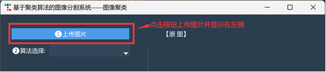
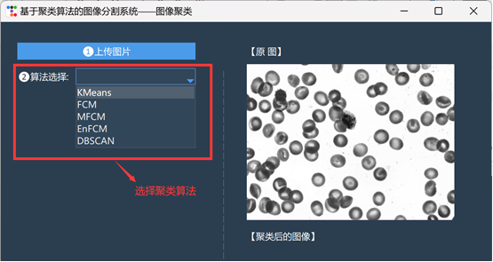
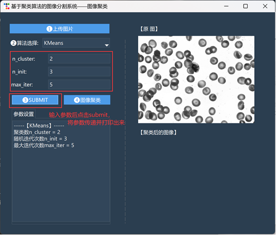
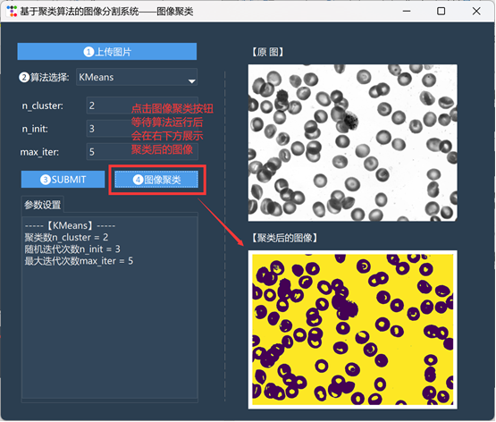
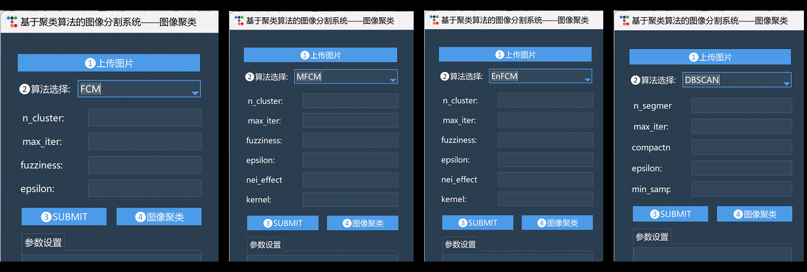

<div align="center">

# 基于聚类算法的细胞图像分割系统
组长：张柏兰 | 组员：周一卓、赵穗、王晗 | *2023/12/31*  
by 张柏兰、周一卓
</div>

### 项目框架
```
cluster_system
|--8bit_data     //灰度图像
|--output        //图像输出路径
|--readme_src    //readme文件图片存储
|
|--all_algorithm.py  //汇总代码
|--DBSCAN.py
|--EnFCM.py
|--FCM.py
|--KMeans.py
|--main.py           //入口
|--MFCM.py
|--utils.py
```
### 使用指南(以KMeans为例)  
[1]  上传图片



[2]  算法选择

  

[3]  参数提交与打印

  

[4] 聚类显示

  

### 不同算法的参数输入  
